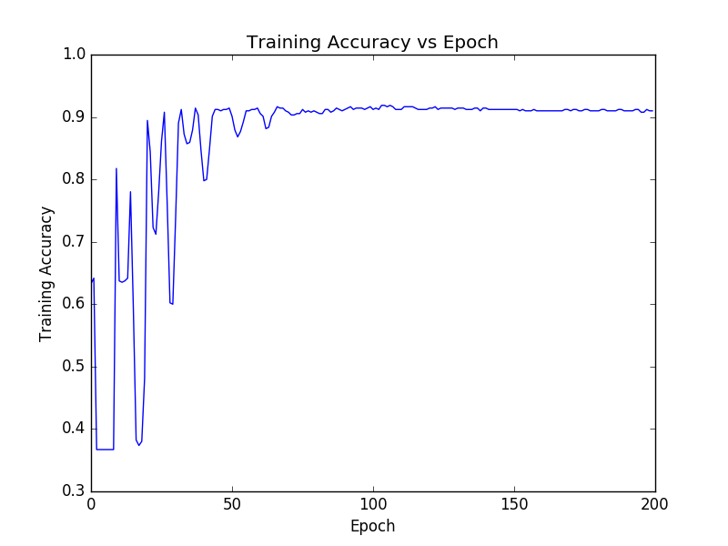

# Breast-Cancer-Phase-Detection
This repository contains the Neural network model to classify Breast Cancer Phase at an accuracy of 92.98%.
There are namely two phases - Benign and Malignant.

## Modules Used
- Tensorflow(ver.1.5)
- Scikit-learn
- Matplotlib
- pandas

## About the dataset
Winconsin Breast Cancer Dataset has been used to train and test the multilayer perceptron model.To know more about the dataset [click here](https://www.kaggle.com/uciml/breast-cancer-wisconsin-data).

## Tesnorflow setup guide
[Click Here](https://www.tensorflow.org/install/install_linux#InstallingVirtualenv) to install and setup tensorflow in your machine.

## Steps for use
- Execute ***ANN.py*** to train,save and visualize the model.
```
python3 ANN.py
```
- Execute ***restore_model.py*** to use the already trained model.
```
python3 restore_model.py
```
## Images

***Original Dataset Visualization***


***Epoch Vs Cost***


***Epoch Vs Train Accuracy***


## Author
***Jiten Sinha***-[LinkedIn](https://www.linkedin.com/in/jiten-sinha-131043159/)

## License
This project is licensed under MIT License.For more information read [LICENSE](https://github.com/jitensinha98/Breast-Cancer-Phase-Detection/blob/master/LICENSE).
